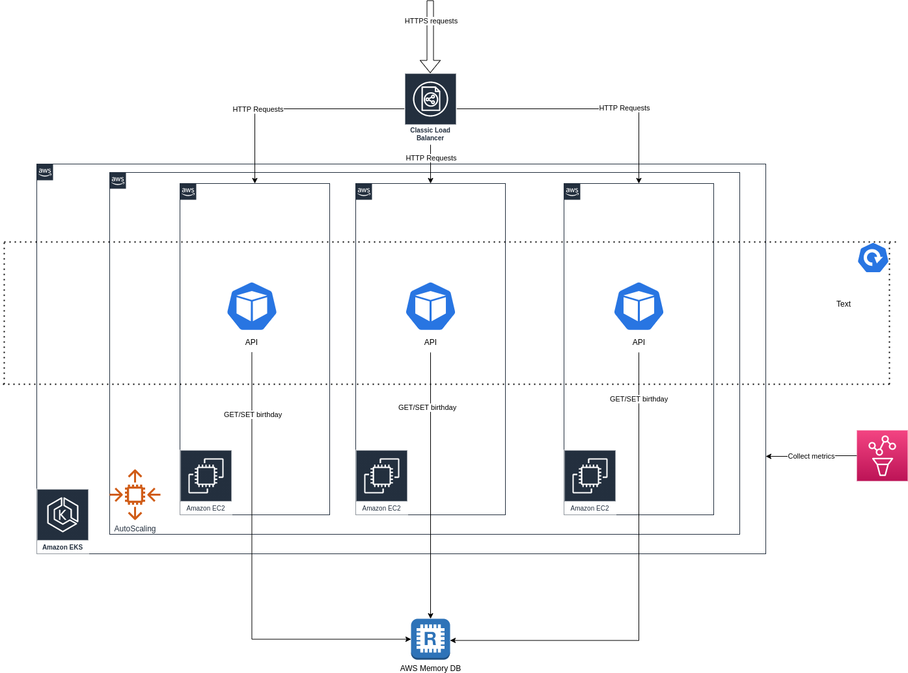

# Hello World


### Deployment

As mentioned in [What is the execution environment ?](What_is_the_execution_environment_?) a Lambda would make more sense for this small app but going for Kubernetes we will need:

1) One EKS environment (this can be easily provisioned via Terraform - [this module](https://registry.terraform.io/modules/terraform-aws-modules/eks/aws/latest) can be a good starting point)
2) A memoryDB instance. For testing purposes the chart now installs an instance of redis in the cluster. If we decide to use that for production we need to configure it to be durable and we have to think about backups.
3) We need to make sure the cluster (specifically the pods) will have access to the memory DB, this means configuring networks access (Security groups) and creating an IAM role that is liked to a Service account for the pods to use.
4) A Pipeline (CodeCommit, GitHub actions anything) with the following steps (most of them can invoke make file commands)
   1) build image
   2) test code
   3) lint code
   4) deploy chart to review environment (this is where the test redis from the chart is used)
   5) deploy chart to live (overwriting configurations)
   7) [Not implemented] - but we can look at post-deploy tests to make sure everything is fine, if not we should roll-back: Smoke tests, anomaly detection, etc ...



#### 0-downtime deployment

In this case we have multiple replicas of the same application and the deployment. The configuration is as follows:
```
type: RollingUpdate
maxUnavailable: 0
maxSurge: 25%
```
So during a deploy we will scale up with 25% more capacity and after the health check passed we will start killing old pods.

For safety measure I also included a Horizontal Pod Auto scaler to cope with high traffic periods (this will only work properly if we have nodes available, we will need to also auto-scale the nodes).
There is also a Pod Disruption Budget to prevent make sure during EKS upgrades (or nodes roll-over) we will have pods alive.

#### Monitoring, Alerting and SLO's

After we have the application running we have to look at monitoring. For this I exported some custom metrics from the app but we should leverage the metrics from Kubernetes (we should install a metrics server) and CloudWatch.

I think it is best to Alert on user problems (if we have an SLO defined it is even better) and in this case I would look at:

* Latency - probably p99 or p95
* Error rate - the api is relatively simple
* Storage - if we don't configure any type of scaling on the storage side we have a hard limit after with we know the app will fail so we need to know if we are aproning that


### Architecture Decision Records


#### What is the execution environment ?

I am considering a few solution here:

* [AWS Lambda](https://aws.amazon.com/lambda/) could run the packaged code directly or even a docker image to adhere to a more open standard
* Kubernetes, specifically [EKS](https://aws.amazon.com/eks/)


For this specific case [AWS Lambda](https://aws.amazon.com/lambda/) would make sense but there are a few specific reasons to go with [EKS](https://aws.amazon.com/eks/):

1) The tasks allows for AWS or GPC and using Kubernetes as an abstraction layer for both of them should allow multi-cloud deployment
2) With [AWS Lambda](https://aws.amazon.com/lambda/) there are limitation (execution time) and I am not sure if this is a no-go in the future
3) With Kubernetes I have more control and ability to over-engineer the tasks (not a production requirement but using something like [Chalice](https://aws.github.io/chalice/index.html) would make the task extremely boring)


#### What storage solution should I use ?

Looking at the requirements (storing a date for a username) I think a key-value data store makes the most sense as we only have on relationship.
Redis looks like a good candidate:

* It scaled well
* It is available on both cloud providers
* I can run it locally or in a review environment

The only downsized is the durability of the data.
For AWS we have [MemoryDB](https://aws.amazon.com/memorydb/) that can guaranteed durability.

For GCP the situation is a bit more complicated.
[Memorystore](https://cloud.google.com/memorystore/docs/redis/redis-overview) supports only [point in time snapshots](https://cloud.google.com/memorystore/docs/redis/redis-overview#differences_between_managed_and_open_source_redis) this will expose us to always lose a wind's of time.
So will either have to use Redis Labs as a provider for this or we host our own in GKE


There is another option I was looking it but I don't have the time to implement a PoC for it:
To use two separate products and abstract them at the code level. For example use [dynamodb](https://aws.amazon.com/dynamodb/) for AWS and [Cloud Firestore](https://firebase.google.com/docs/firestore) for GPC.

##### ToDo

- [x] PoC of the app
- [x] Add test and improve architecture
- [x] Build docker image
- [x] Create local Makefile
- [x] Create v1 of the helm chart
- [x] Add redis as a dependency
- [x] Document the production architecture diagram and what needs to change from the local setup
- [x] Improve README and documentation
- [x] Document a CI/CD pipeline
- [x] Add monitoring
- [x] Create a production-ready checklist
  - [x] Data storage
  - [x] Monitoring
  - [x] SLO's
  - [x] Alerting
  - [x] 0 downtime deployment
  - [x] scaling
